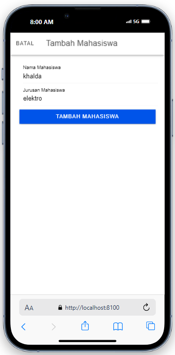
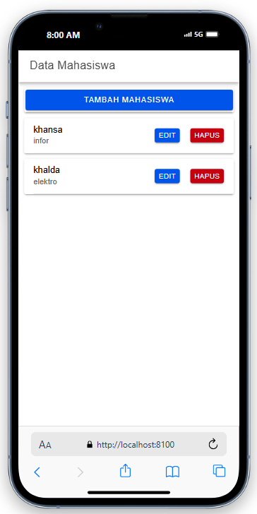
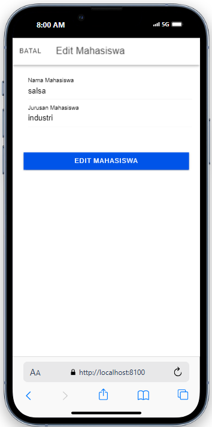
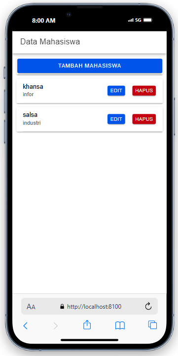
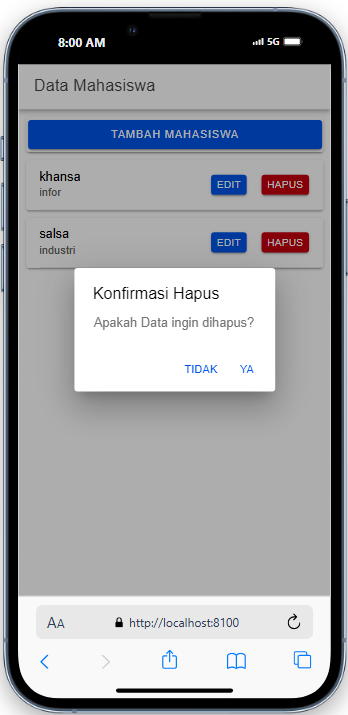
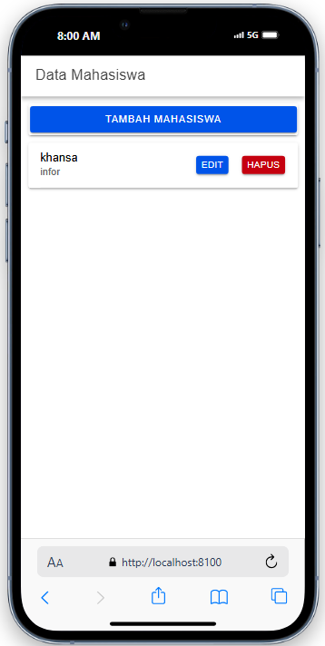

# Aplikasi CRUD Mahasiswa

Aplikasi ini merupakan implementasi CRUD (Create, Read, Update, Delete) untuk mengelola data mahasiswa menggunakan Angular dan Ionic Framework. Berikut adalah penjelasan lengkap untuk setiap proses CRUD beserta screenshot dari setiap langkah.

## 1. Create: Menambahkan Mahasiswa

### Screenshot: Proses Menambah Mahasiswa

**Penjelasan:**

- Pengguna dapat menambahkan mahasiswa baru dengan mengklik tombol "Tambah Mahasiswa" yang terletak di halaman utama.
- Setelah tombol ditekan, modal akan muncul yang memungkinkan pengguna untuk mengisi nama dan jurusan mahasiswa.
- Setelah formulir diisi, pengguna dapat menekan tombol "Tambah Mahasiswa" untuk menyimpan data.
- Data mahasiswa yang baru akan ditambahkan ke daftar mahasiswa.

---

## 2. Read: Menampilkan Data Mahasiswa

### Screenshot: Menampilkan Daftar Mahasiswa

**Penjelasan:**

- Data mahasiswa yang telah disimpan akan ditampilkan dalam bentuk daftar pada halaman utama.
- Setiap data mahasiswa menampilkan nama dan jurusan mereka.
- Pengguna dapat memilih untuk mengedit atau menghapus data mahasiswa dengan tombol yang tersedia pada setiap item mahasiswa.

---

## 3. Update: Mengedit Data Mahasiswa

### Screenshot: Proses Mengedit Mahasiswa

**Penjelasan:**

- Untuk mengedit data mahasiswa, pengguna cukup mengklik tombol "Edit" di samping data mahasiswa yang ingin diedit.
- Modal edit akan muncul, memungkinkan pengguna untuk memperbarui nama dan jurusan mahasiswa.
- Setelah perubahan selesai, pengguna dapat menekan tombol "Edit Mahasiswa" untuk menyimpan pembaruan.
- Data mahasiswa yang telah diperbarui akan langsung terlihat pada daftar mahasiswa.

---

## 4. Delete: Menghapus Data Mahasiswa

### Screenshot: Konfirmasi Hapus Mahasiswa

**Penjelasan:**

- Pengguna dapat menghapus data mahasiswa dengan mengklik tombol "Hapus" di samping data mahasiswa.
- Sebelum penghapusan dilakukan, aplikasi akan menampilkan dialog konfirmasi untuk memastikan tindakan ini.
- Jika pengguna menekan tombol "Ya" pada dialog konfirmasi, data mahasiswa akan dihapus dan tidak lagi muncul di daftar mahasiswa.
- Jika pengguna menekan tombol "Tidak" pada dialog konfirmasi, maka akan dikembalikan ke halaman daftar mahasiswa.

---

## Kesimpulan

Aplikasi CRUD Mahasiswa ini memberikan fitur lengkap untuk menambah, menampilkan, mengedit, dan menghapus data mahasiswa. Setiap proses di atas memiliki tampilan yang intuitif dan mudah digunakan. Pengguna dapat dengan mudah mengelola data mahasiswa mereka menggunakan aplikasi ini.

Kelengkapan proses (tambah, lihat, edit, hapus) sangat penting untuk memberikan pengalaman pengguna yang baik dan memudahkan pengelolaan data.
